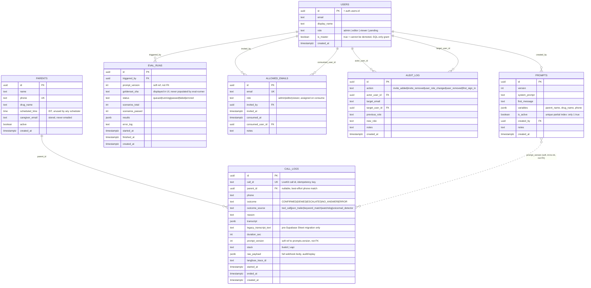
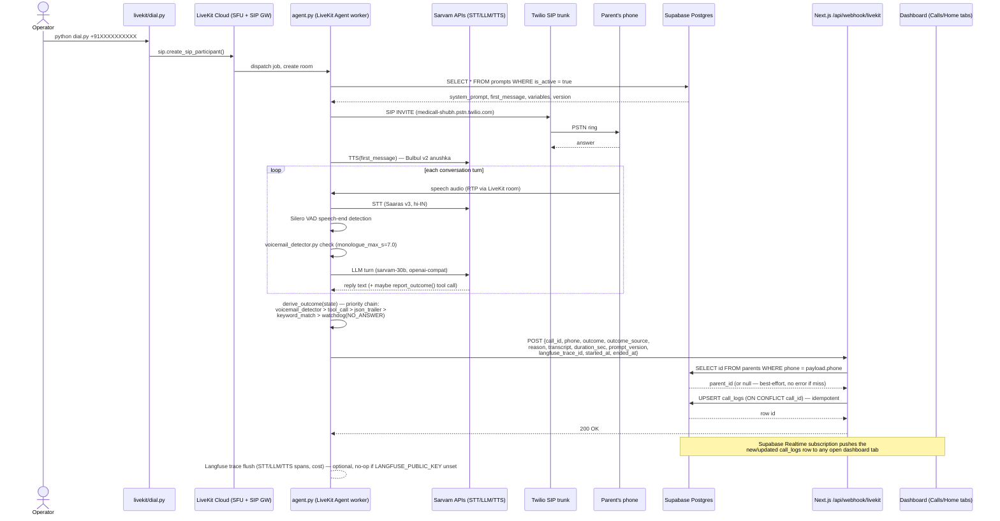
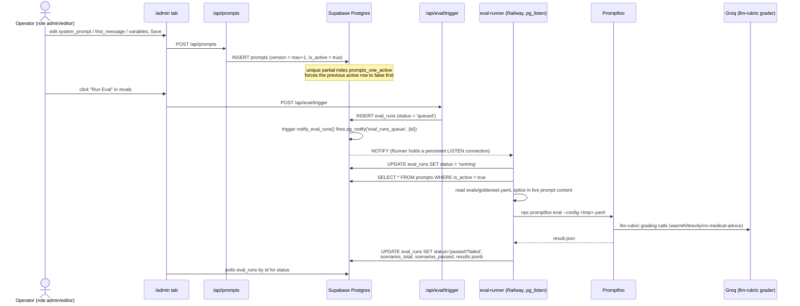
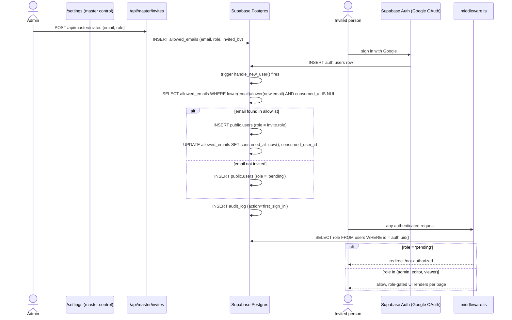
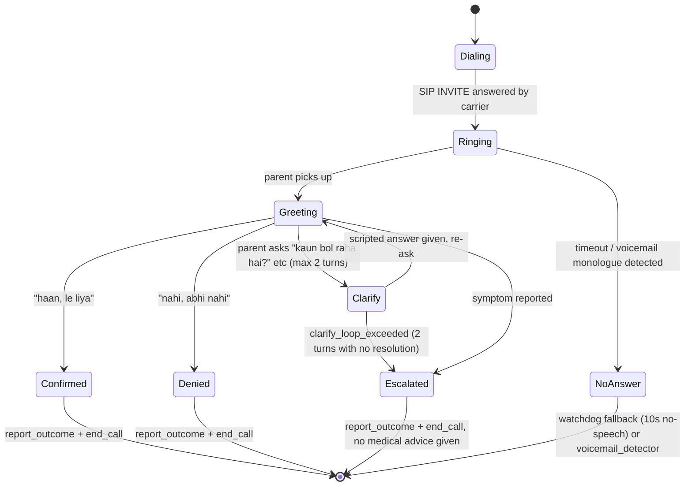
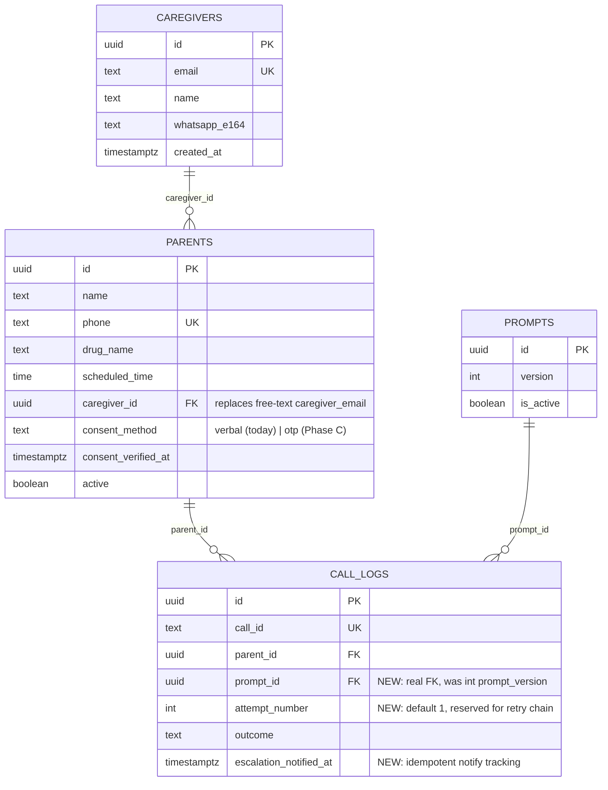

# MediCall AI — DB Schema, User Flows & Data-Flow Analysis

**Date:** 2026-07-13
**Author:** Claude Code (analysis session)
**Status:** Working reference. Not a locked spec — use it to drive PRD-TRD v4 decisions.
**Inputs read:** `PRD-TRD.md` (v3, locked, 2026-06-21), `docs/archive/2026-06-15-medicall-prd-trd-v2.md` (v2/superseded, richer on Phase B/C detail), `supabase/migrations/001_initial_schema.sql`, `supabase/migrations/002_master_control.sql`, `dashboard/src/lib/types.ts`, all `dashboard/src/app/api/**/route.ts`, `livekit/agent.py`, `eval-runner/src/index.ts`, `dashboard/src/middleware.ts`.

This doc has three parts:

1. **What's actually built** — schema, ERD, and data-flow diagrams reverse-engineered from the current codebase (not the PRD's aspirational version).
2. **Gap analysis** — where the PRD (either version) describes something that isn't there yet, and where the codebase quietly went a different direction than either PRD.
3. **Recommendations** — concrete schema/flow changes, ranked by effort vs. payoff, for you to pick from.

---

## Part 1 — Current state (as implemented, 2026-07-13)

### 1.1 Entity-relationship diagram

**Read this ERD with two caveats in mind, because they matter for every decision below:**

- `call_logs.prompt_version` and `eval_runs.prompt_version` are **plain integers**, not foreign keys into `prompts.id`. There is no `ON DELETE` behavior, no join integrity, and no way for Postgres to stop you from logging a call against a prompt version that was later deleted. Every join from `call_logs` to `prompts` in application code has to be `WHERE prompts.version = call_logs.prompt_version`, which breaks silently if versions are ever renumbered or a prompt row is deleted and re-inserted with the same version.
- **RLS is enabled on every table but every policy is `USING (true) WITH CHECK (true)`** — i.e., RLS is on in name only. All real access control lives in `dashboard/src/middleware.ts` (route-level, session-cookie based) and in ad-hoc role checks inside individual API route handlers. If the Supabase anon key is ever used to query these tables directly from a browser (not currently done, but easy to introduce by accident in a future client component), there is **zero database-level protection** — any authenticated *or even anonymous* Supabase client can read/write every row in every table.

### 1.2 Call lifecycle — table-to-table data flow

This is the flow that actually runs today, traced through `agent.py`, the webhook route, and the dashboard.

**Notable current behavior baked into this flow:**
- `parent_id` resolution is silent-best-effort: if the phone number doesn't match any row in `parents`, the call is still logged with `parent_id = null` and nothing surfaces that mismatch to an operator. Over time this can produce call logs that are effectively orphaned and invisible from a parent-scoped view.
- `raw_payload jsonb` stores the entire webhook body verbatim — this is a nice safety net (nothing is ever lost even if the typed columns don't capture a new field) but nobody currently replays or diffs against it.
- There is no step where an operator or the dashboard *triggers* the call — `dial.py` is a standalone CLI script run by hand on a laptop. The PRD's `/api/livekit-dispatch` route and dashboard "Place Call" button are not implemented (see Gap Analysis).

### 1.3 Prompt edit → eval run — table-to-table data flow

**Note:** `eval_runs.goldenset_sha` is rendered in the `/evals` detail view (`dashboard/src/app/(app)/evals/page.tsx:171`) but is **never written** by `eval-runner/src/index.ts` — it is always `null` in production. This is a dead field in the UI today.

### 1.4 Auth / invite / role — table-to-table data flow

**Notable design choice worth keeping in mind:** `handle_new_user()` deliberately inserts `public.users` **before** consuming the invite (see migration 002, Phase 1–3 comments, and the most recent commit `5658b58`) specifically to avoid a foreign-key violation on `allowed_emails.consumed_user_id`. This was a real bug that got fixed — the ordering is load-bearing, not incidental.

### 1.5 Call-outcome state machine (user-facing flow, unchanged by this analysis but included for completeness)

---

## Part 2 — Gap analysis: planned vs. built

Two PRDs exist. `PRD-TRD.md` (v3, root, **locked, current source of truth**) is Hindi-only, Phase-0-focused, and is what the codebase actually tracks closely. `docs/archive/2026-06-15-medicall-prd-trd-v2.md` (v2, superseded) has richer detail on Phase A/B/C — consent, retry chains, OCR, multi-language — that v3 deliberately deferred rather than dropped. Both are referenced below.

| # | Area | What the PRD says | What's actually built | Severity |
|---|---|---|---|---|
| 1 | **Call trigger** | v3 §7/§15.3: dashboard `/api/livekit-dispatch` POST, "Place test call" CTA on Home | No such route exists anywhere in `dashboard/src/app/api/`. Calls are placed by running `python dial.py +91...` by hand on a laptop. | **High** — this is the single biggest gap between "what the dashboard claims to be" (a Vapi-mirror control center) and what an operator can actually do from it. |
| 2 | **Automatic scheduler** | v3 Phase A: cron-triggered calls, no more manual dial | `parents.scheduled_time` column exists and is exposed in the CRUD API/UI, but **nothing reads it**. No cron, no QStash, no scheduled function. It's a UI field with no consumer. | Medium — expected to be Phase A, but worth knowing it's 100% inert today, not "partially wired." |
| 3 | **Costs tab** | v3 §15.2: `/costs` proxies Langfuse cost API, 5-min cache, Recharts rollups | `dashboard/src/app/(app)/costs/page.tsx` is a **static hardcoded table** of per-vendor unit costs (no DB query, no Langfuse call, no live numbers). | Medium — looks live in the UI, isn't. Risk of an operator trusting stale numbers. |
| 4 | **Settings tab** | v3 §15.2: API key rotation UI (Supabase Vault), vendor toggles (Sarvam↔Deepgram fallback) | `dashboard/src/app/(app)/settings/page.tsx` shows a static "Connected" badge list and account info only. No key rotation, no toggle actually flips a runtime config. | Low-medium — same "looks live, isn't" pattern as Costs. |
| 5 | **RLS** | v3 §17/§18: "No RLS for pilot — internal tool… Phase A re-evaluation" | RLS is *enabled* but every policy is `using (true)` — i.e., the PRD's stated posture ("no RLS") and the migration's actual posture ("RLS on, permissive") match in effect but not in appearance. This is fine as long as **no client-side Supabase call ever uses the anon key against these tables** — worth a lint/grep check before Phase A, since a caregiver-facing surface would need real policies. | Medium (latent, becomes acute in Phase A) |
| 6 | **`caregiver_email` on `parents`** | Present in both PRD schema and implementation | Column exists, is collected in the `/schedule` CRUD form, but **nothing ever sends an email to it**. No escalation notification path exists at all — an ESCALATED call is visible only if someone is looking at the dashboard. | **High** — this is the single highest-stakes gap: v3 §3 promises "Caregiver is notified within minutes" on ESCALATED, and that promise is currently unfulfilled in code. |
| 7 | **Retry chain (3-strike NO_ANSWER)** | v2 §Phase A: 15-min/30-min retry slots via QStash | Not built; `call_logs` has no `attempt_number` column at all (v2's Phase-A schema had one, v3's schema dropped it). A `NO_ANSWER` today is terminal — nobody retries. | Medium — explicitly Phase A scope, but the schema doesn't even reserve a column for it yet, so adding it later is a migration, not a toggle. |
| 8 | **Consent audit trail** | v2 §4/§5.2: `consent_method`, `consent_verified_at`, `consent_otp_hash` on `parent`; `consent_audit` table at Phase A | None of this exists in the current `parents` table. There is no record, anywhere in the DB, of *when* or *how* consent was obtained for a given parent. | Medium-high for compliance posture, low urgency at 5-parent pilot scale. |
| 9 | **`prompt_version` as soft reference** | Both PRDs specify `int` (not FK) | Matches the PRD, but it's worth flagging as a self-inflicted gap either way — see ERD caveat above. | Medium |
| 10 | **`goldenset_sha`** | v3 §17 defines the column; §21 payload includes it conceptually | Column exists, is rendered in the UI, is **never populated** by `eval-runner`. Dead field. | Low |
| 11 | **Multi-caregiver / multi-parent** | v2 Phase B: "one patient → up to 3 caregivers"; v3 stays 1:1 | Current schema is strictly 1 parent : 1 `caregiver_email` string (not even a FK to a caregiver entity — there's no `caregivers` table at all, just a free-text email column on `parents`). | Low now, structural blocker later — adding a real `caregivers` table is a bigger migration than adding a column, so worth doing before any caregiver dashboard work starts. |
| 12 | **Language field** | v2: `language` enum on `parent`, Hindi-only Phase A/B gate | No `language` column on `parents` at all — Hindi is hardcoded at the agent level (`hi-IN`, Bulbul anushka). Fine for Phase 0, but Phase B (six-language design already scaffolded in `../voiceAgent01-docs/`) will need this column plus a per-language prompt variant, neither of which exist yet. | Low now |
| 13 | **Audit coverage** | Master-control spec (002 migration) scopes `audit_log` to auth/invite/role events only | Matches what's built — `audit_log.action` enum has no `prompt_saved`, `call_placed`, or `eval_triggered` values. So today there's good audit trail for *who has access*, and zero audit trail for *who did what with a prompt or a call*. Worth naming explicitly since it's easy to assume "we have an audit log" covers more than it does. | Medium |
| 14 | **Idempotency / dedup on webhook** | v3 §10.10: "idempotent on call_id" | Correctly implemented via `upsert(... onConflict: 'call_id')`. ✅ No gap. | — |
| 15 | **Voicemail + watchdog + tool-call outcome chain** | v3 §13 full spec | Implemented essentially as specified in `agent.py` (`derive_outcome`, `report_outcome`, `end_call`, `_watchdog`, `voicemail_detector.py` wired to `user_speech_committed`). ✅ No gap — this is the part of the PRD that's most faithfully shipped. | — |

---

## Part 3 — Recommendations (ranked)

These are scoped to *this* codebase's actual shape, not a rewrite. Ordered by (impact on the product's core promise) ÷ (migration effort).

### Tier 1 — closes an explicit broken promise

1. **Wire ESCALATED → caregiver notification.** This is the largest gap: v3 §3 explicitly promises "Caregiver is notified within minutes" and nothing delivers that today. Minimum viable version: on webhook receipt, if `outcome = 'ESCALATED'`, look up `parents.caregiver_email` and send a transactional email (Resend/Postmark — cheapest path, no new vendor category needed beyond what Phase C already plans for WhatsApp). Add a `call_logs.escalation_notified_at timestamptz` column so the webhook is idempotent and the dashboard can show "notified ✓ / not sent ✗." This is a one-migration, one-route change, not a new service.

2. **Give the dashboard a real "Place Call" path.** Add `/api/livekit-dispatch` (POST `{parent_id}` → resolves phone/drug_name from `parents`, calls the same `lkapi.sip.create_sip_participant()` path `dial.py` already uses) and wire it to a button on `/schedule` or `/`. This turns the dashboard from "read-only mirror of a CLI tool" into the actual operator surface the PRD describes, and is a prerequisite for the automatic scheduler later. Low effort — it's mostly porting `dial.py`'s dispatch call into a route handler.

### Tier 2 — de-risks before the next phase, cheap now / expensive later

3. **Make `call_logs.prompt_version` a real FK.** Change to `prompt_id uuid references prompts(id)`, backfill from the existing `version` column via a join, keep `prompt_version int` only as a denormalized display column if you want the human-readable number. Cheap today (small table), painful later once call volume is in the thousands.

4. **Stop rendering dead fields as if they're live.** Either populate `eval_runs.goldenset_sha` (compute a hash of `goldenset.yaml` in `eval-runner` and write it back — a few lines) or remove it from the UI. Same call for Costs/Settings tabs: either wire them to real data (Langfuse cost API, a real vendor-toggle env write) or label them clearly as "Phase A preview" so nobody mistakes the hardcoded numbers for live ones. Trust in the dashboard's other real-time data (which *is* accurate) is worth protecting.

5. **Add a `caregivers` table now, even before multi-caregiver logic.** Replace the free-text `parents.caregiver_email` with `parents.caregiver_id uuid references caregivers(id)`, where `caregivers` has `id, email, name, whatsapp_e164, created_at`. This costs almost nothing today (still 1:1) but avoids a much bigger migration when Phase B's multi-caregiver requirement lands — you'd otherwise be migrating a column that's already scattered across webhook payloads, CRUD forms, and notification logic.

### Tier 3 — schema reservations for phases you already know are coming

6. **Reserve `call_logs.attempt_number int default 1`** now, even with no retry logic behind it yet. Costs nothing, and means the retry chain (Tier-2 PRD item) is a logic change later, not a schema change + backfill.

7. **Add a minimal `consent_method`, `consent_verified_at` pair to `parents`** and have the existing `/schedule` create-parent form require them (even if `consent_method` only ever has the value `'verbal'` today). This turns "we should track consent" from a Phase-C migration into something that's already flowing in as data, so the Phase-C OTP work only has to add a new `consent_method` value rather than backfill months of ungoverned rows.

8. **Extend `audit_log.action`** to include `prompt_saved` and `call_placed` (trivial once #2 above exists — just insert alongside the dispatch call). This is the cheapest way to close gap #13: you already have the audit infrastructure, it's just scoped too narrowly.

### Not recommended right now

- **Multi-language schema (`parents.language`)** — defer until Phase B actually starts; adding it now with no consumer is exactly the kind of dead-field risk called out in #4.
- **Tightening RLS to real per-role policies** — defer until there's an actual caregiver-facing surface that needs row isolation; doing it now for an all-internal, 3-person tool is process overhead without a corresponding risk reduction.

---

## Proposed near-term schema delta (Tier 1 + Tier 2, illustrative)

---

*This document is a snapshot analysis, not a migration plan. If any Tier-1/2 item above is picked up, write the actual migration SQL as `supabase/migrations/003_*.sql` following the same pattern as `001`/`002` (transaction-wrapped, idempotent `create table if not exists` / `add column if not exists`, comment-documented rationale inline).*
