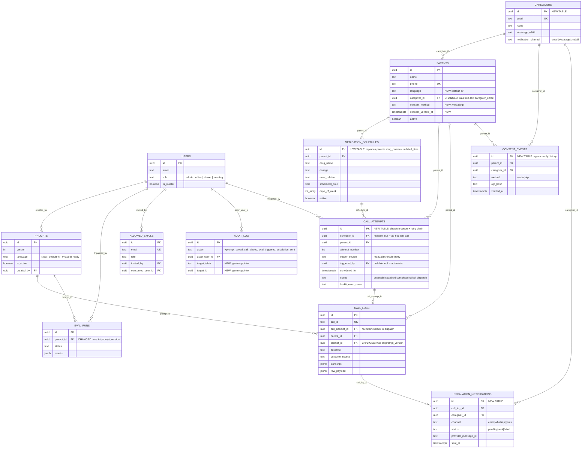
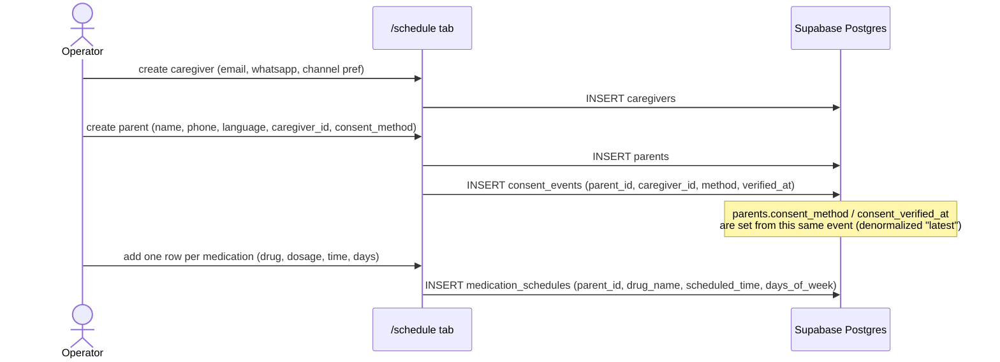
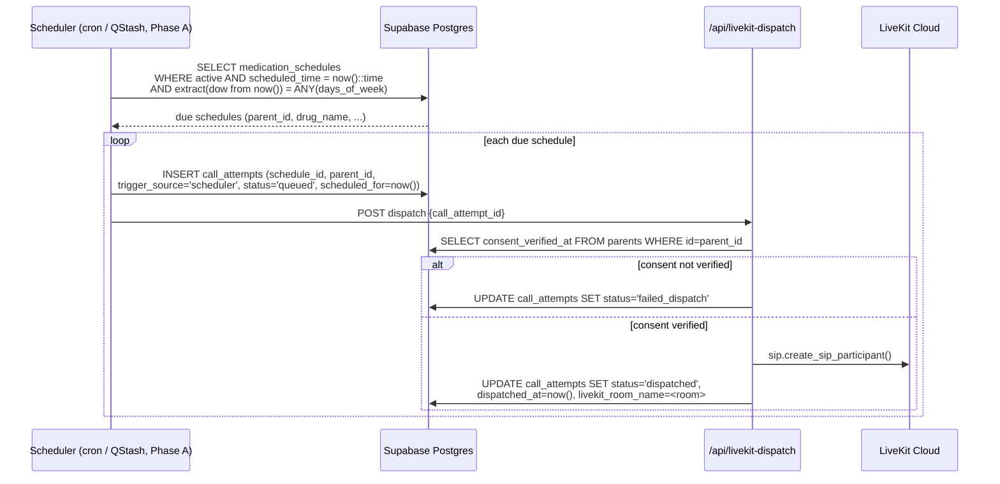
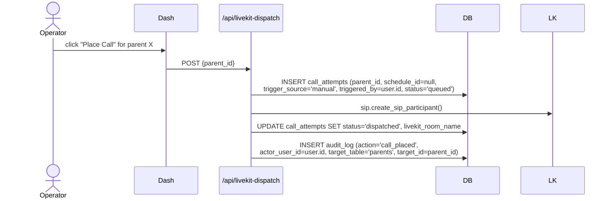
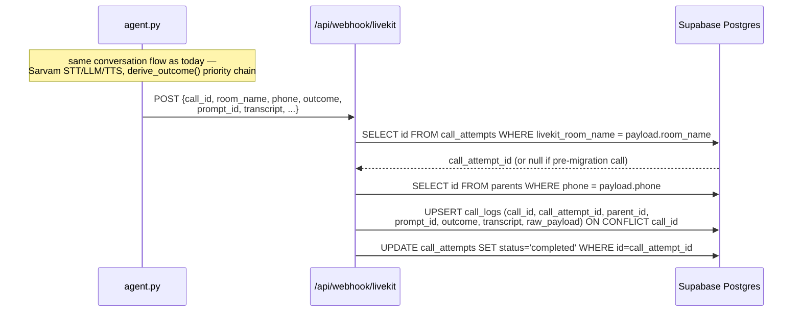
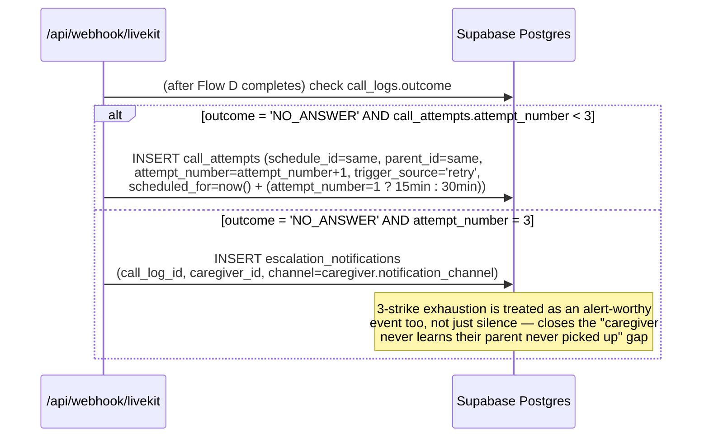
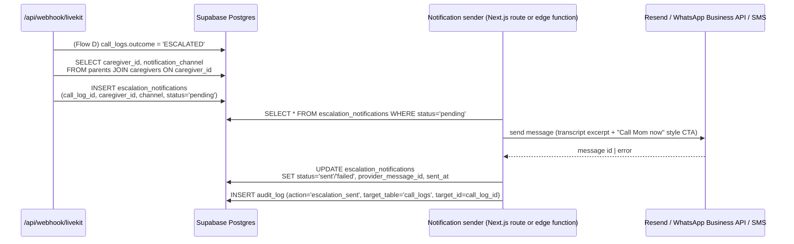
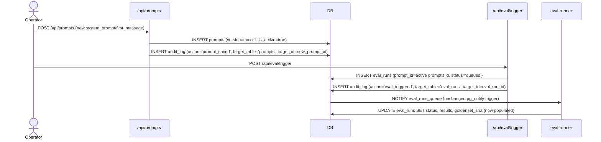

# MediCall AI — Target Schema & Table-to-Table Data Flow

**Date:** 2026-07-13
**Status:** Design reference for the next migration (`003_*` onward). Not yet applied.
**Companion doc:** `docs/2026-07-13-db-schema-dataflow-analysis.md` (as-built schema + gap analysis this doc resolves).

This doc is the concrete answer to "what tables do we need, total, and how does data move between them" —
combining what's already implemented with the Tier-1/2 gaps identified in the companion analysis
(caregiver notifications, real call dispatch, retry chain, consent tracking, multi-drug schedules).

Scope: Phase 0 → Phase A tables only. Phase C items (OCR/prescriptions, Razorpay billing, DPDP OTP
cryptographic bind) are deliberately **not** designed here — see the note at the end.

---

## 1. Full target ERD

---

## 2. Table catalog

Legend: 🟢 unchanged · 🟡 refined (columns added/moved) · 🔵 new table.

### 🟢 `users` — internal operators (unchanged)

| Column | Type | Notes |
|---|---|---|
| `id` | uuid PK | = `auth.users.id` |
| `email` | text | |
| `display_name` | text | |
| `role` | text, check in (`admin`,`editor`,`viewer`,`pending`) | app-layer permission tier |
| `is_master` | boolean | SQL-only grant, cannot be demoted via UI |
| `created_at` | timestamptz | |

### 🟢 `allowed_emails` — invite list (unchanged)

| Column | Type | Notes |
|---|---|---|
| `id` | uuid PK | |
| `email` | text UK | |
| `role` | text, check in (`admin`,`editor`,`viewer`) | role granted on consume |
| `invited_by` | uuid FK → users | |
| `invited_at` | timestamptz | |
| `consumed_at` | timestamptz nullable | |
| `consumed_user_id` | uuid FK → users nullable | |
| `notes` | text | |

### 🟡 `audit_log` — generalized action log

| Column | Type | Notes |
|---|---|---|
| `id` | uuid PK | |
| `action` | enum | existing: `invite_added`, `invite_removed`, `user_role_changed`, `user_removed`, `first_sign_in`. **Add:** `prompt_saved`, `call_placed`, `eval_triggered`, `escalation_sent`. |
| `actor_user_id` | uuid FK → users nullable | null = system/scheduler action |
| `target_email` | text nullable | kept for existing invite/role events |
| `target_user_id` | uuid FK → users nullable | kept for existing invite/role events |
| `target_table` | text nullable | **NEW** — e.g. `'parents'`, `'prompts'`, `'call_attempts'` |
| `target_id` | uuid nullable | **NEW** — generic pointer to the affected row, so one enum can cover prompt/call/escalation events without a column per event type |
| `previous_role` / `new_role` | text nullable | role-change events only |
| `notes` | text | |
| `created_at` | timestamptz | |

**Why:** the current `audit_log` only covers *who has access* (invites, roles, sign-ins). Adding `target_table`/`target_id` and four action values turns it into the single place that answers "who placed this call" / "who edited this prompt" / "did the escalation actually send" — without a bespoke table per event type.

### 🟡 `prompts` — add language

| Column | Type | Notes |
|---|---|---|
| `id` | uuid PK | |
| `version` | int | |
| `language` | text default `'hi'` | **NEW** — always `'hi'` until Phase B; column exists now so Phase B is a value-range change, not a migration |
| `system_prompt` / `first_message` | text | |
| `variables` | jsonb | |
| `is_active` | boolean | unique partial index stays scoped to `is_active` alone while `language` has only one value in use; revisit to `(is_active, language)` when Phase B ships a second language |
| `created_by` | uuid FK → users | |
| `notes` | text | |
| `created_at` | timestamptz | |

### 🟡 `eval_runs` — real FK to prompt

| Column | Type | Notes |
|---|---|---|
| `id` | uuid PK | |
| `triggered_by` | uuid FK → users | |
| `prompt_id` | uuid FK → prompts.id | **CHANGED** — was `prompt_version int` with no referential integrity |
| `goldenset_sha` | text | column already exists; **populate it** from `eval-runner` (hash `goldenset.yaml` at run time) — it's rendered in the UI today but always null |
| `status`, `scenarios_total`, `scenarios_passed`, `results`, `error_log` | — | unchanged |
| `started_at` / `finished_at` / `created_at` | timestamptz | unchanged |

### 🔵 `caregivers` — new table

The current schema has no caregiver *entity* — just a free-text `parents.caregiver_email` column. That blocks notification-channel preference, multi-caregiver (Phase B), and any FK-level integrity between a call's escalation and who it's actually going to.

| Column | Type | Notes |
|---|---|---|
| `id` | uuid PK | |
| `email` | text UK not null | |
| `name` | text | |
| `phone_e164` | text nullable | |
| `whatsapp_e164` | text nullable | |
| `notification_channel` | text, check in (`email`,`whatsapp`,`sms`,`all`) default `'email'` | drives which channel(s) `escalation_notifications` fan out to |
| `created_at` | timestamptz | |

### 🟡 `parents` — refined

| Column | Type | Notes |
|---|---|---|
| `id` | uuid PK | |
| `name` | text | |
| `phone` | text UK | |
| `language` | text default `'hi'` | **NEW**, same rationale as `prompts.language` |
| `caregiver_id` | uuid FK → caregivers.id | **CHANGED** — replaces free-text `caregiver_email` |
| `consent_method` | text, check in (`verbal`,`otp`) default `'verbal'` | **NEW** — fast current-status lookup |
| `consent_verified_at` | timestamptz nullable | **NEW** — paired with above; full history lives in `consent_events` |
| `active` | boolean | unchanged |
| `created_at` | timestamptz | unchanged |
| ~~`drug_name`~~ / ~~`scheduled_time`~~ | — | **REMOVED** — moved to `medication_schedules` because a parent can be on more than one drug/time (current schema hard-codes exactly one, which blocks the already-stated multi-drug goal) |

### 🔵 `medication_schedules` — new table

Replaces the flattened `drug_name`/`scheduled_time` columns on `parents` so one parent can have N medications at N times/days — this is a currently-missing feature (today's schema physically cannot represent "Dad takes BP tablet at 8am and thyroid tablet at 9pm").

| Column | Type | Notes |
|---|---|---|
| `id` | uuid PK | |
| `parent_id` | uuid FK → parents.id | |
| `drug_name` | text not null | |
| `dosage` | text nullable | e.g. "1 tablet" |
| `meal_relation` | text, check in (`before_meal`,`after_meal`,`with_meal`,`no_relation`) nullable | |
| `scheduled_time` | time not null | IST |
| `days_of_week` | int[] default `'{0,1,2,3,4,5,6}'` | 0=Sun…6=Sat |
| `active` | boolean default true | pause a single medication without deactivating the whole parent |
| `created_at` / `updated_at` | timestamptz | |

### 🔵 `call_attempts` — new table (the missing dispatch queue)

This is the table that makes both "Place Call from the dashboard" and "automatic scheduler" and "3-strike retry" possible — none of which exist today because there is currently no row representing "a call that should happen," only rows representing calls that already happened (`call_logs`).

| Column | Type | Notes |
|---|---|---|
| `id` | uuid PK | |
| `schedule_id` | uuid FK → medication_schedules.id nullable | null = ad-hoc/manual test call not tied to a recurring schedule |
| `parent_id` | uuid FK → parents.id not null | |
| `attempt_number` | int default 1 | 1, 2, or 3 — powers the retry chain |
| `trigger_source` | text, check in (`manual`,`scheduler`,`retry`) | who/what created this row |
| `triggered_by` | uuid FK → users.id nullable | null when `trigger_source` is `scheduler` or `retry` |
| `scheduled_for` | timestamptz not null | when this attempt should fire (`now()` for manual, computed for retry: `+15min`/`+30min`) |
| `status` | text, check in (`queued`,`dispatched`,`completed`,`failed_dispatch`) default `'queued'` | |
| `livekit_room_name` | text nullable | set at dispatch time; the webhook uses this to match a completed call back to its attempt |
| `dispatched_at` | timestamptz nullable | |
| `created_at` | timestamptz | |

### 🟡 `call_logs` — refined

| Column | Type | Notes |
|---|---|---|
| `id` | uuid PK | |
| `call_id` | text UK | LiveKit call id, idempotency key — unchanged |
| `call_attempt_id` | uuid FK → call_attempts.id nullable | **NEW** — links a completed call back to the dispatch row that queued it; null for calls placed before this table existed |
| `parent_id` | uuid FK → parents.id nullable | unchanged (best-effort phone match) |
| `prompt_id` | uuid FK → prompts.id | **CHANGED** — was `prompt_version int`, no FK |
| `phone`, `outcome`, `outcome_source`, `reason` | — | unchanged |
| `transcript`, `legacy_transcript_text` | jsonb / text | unchanged |
| `duration_sec`, `stack`, `raw_payload`, `langfuse_trace_id` | — | unchanged |
| `started_at` / `ended_at` / `created_at` | timestamptz | unchanged |

### 🔵 `escalation_notifications` — new table (the missing "caregiver notified" mechanism)

Today an `ESCALATED` outcome is written to `call_logs` and nothing else happens — no email, no WhatsApp, no SMS. This table is the delivery ledger: one row per (call, caregiver, channel), so it supports multi-channel fan-out, retry-on-failure, and answers "was the caregiver actually notified, and when" without overloading `call_logs` with delivery-state columns.

| Column | Type | Notes |
|---|---|---|
| `id` | uuid PK | |
| `call_log_id` | uuid FK → call_logs.id | |
| `caregiver_id` | uuid FK → caregivers.id | |
| `channel` | text, check in (`email`,`whatsapp`,`sms`) | one row per channel actually attempted |
| `status` | text, check in (`pending`,`sent`,`failed`) default `'pending'` | |
| `provider_message_id` | text nullable | Resend/Twilio/WhatsApp message id, for delivery-status webhooks later |
| `error` | text nullable | |
| `sent_at` | timestamptz nullable | |
| `created_at` | timestamptz | |

### 🔵 `consent_events` — new table (DPDP audit trail)

`parents.consent_method`/`consent_verified_at` above answer "what's the current consent state," but a compliance audit needs *history* — every time consent was captured, re-confirmed, or (eventually, Phase C) revoked. This table is append-only; the `parents` columns are a denormalized "latest" pointer for fast checks before dialing.

| Column | Type | Notes |
|---|---|---|
| `id` | uuid PK | |
| `parent_id` | uuid FK → parents.id | |
| `caregiver_id` | uuid FK → caregivers.id | who attested consent |
| `method` | text, check in (`verbal`,`otp`) | `otp` unused until Phase C, column ready |
| `otp_hash` | text nullable | Phase C only |
| `verified_at` | timestamptz | |
| `notes` | text nullable | e.g. "caregiver re-confirmed after parent moved house" |
| `created_at` | timestamptz | |

---

## 3. Data flow — table to table

### Flow A — Onboarding: caregiver → parent → consent → medications

### Flow B — Automatic scheduler dispatch (currently missing feature)

### Flow C — Manual dispatch (operator clicks "Place Call")

### Flow D — Call lifecycle, now closing the loop back to `call_attempts`

### Flow E — Retry chain on `NO_ANSWER` (currently missing feature)

### Flow F — `ESCALATED` → caregiver notification delivery (currently missing feature)

### Flow G — Prompt edit → eval run (unchanged shape, updated FK)

---

## 4. Explicitly out of scope for this doc

Kept out because there's no near-term consumer yet — adding these tables now would be exactly the
"dead field" risk called out in the companion analysis (§Costs/§Settings/§goldenset_sha):

- **`prescriptions`, `prescription_line_items`** (OCR ingestion, Veryfi) — Phase C.
- **`payments`, `subscriptions`** (Razorpay billing) — Phase C.
- **`consent_events.otp_hash` actually being used** (cryptographic OTP bind) — column is reserved above, but the OTP *flow* (SMS send, caregiver-enters-OTP, hash-and-store) is Phase C, not built here.
- **Row-Level Security policies scoped by `caregiver_id`** — needed once a caregiver-facing (not just operator-facing) surface exists; until then the permissive `USING (true)` policies noted in the companion doc stay as-is.

---

*Next step if any of Part 1–3 above gets picked up: write `supabase/migrations/003_caregivers_and_schedules.sql` (caregivers, medication_schedules, parents refactor) and `004_dispatch_and_escalation.sql` (call_attempts, escalation_notifications, consent_events, call_logs/eval_runs FK fixes) — transaction-wrapped, following the idempotent style of `001`/`002`.*
